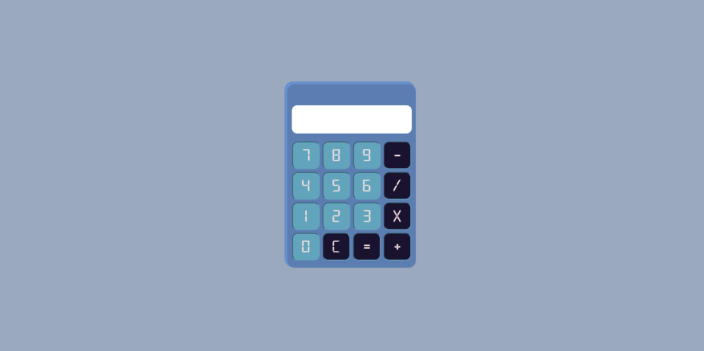

El primer proyecto que hice desde que empece a programar.
Despues de estar un par de semanas cursando el bootcamp de Full Stack Developer en HENRY me propuse hacer una calculadora con Javascript vanilla y CSS puro.
La idea de este proyecto fue poner en practica los conocimientos básicos de javascript, manipulacion del DOM y CSS puro.

<a href='https://calculadora-snowy-theta.vercel.app/'>Link al proyecto</a>

